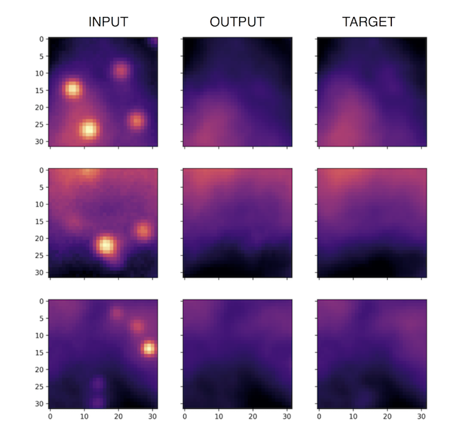
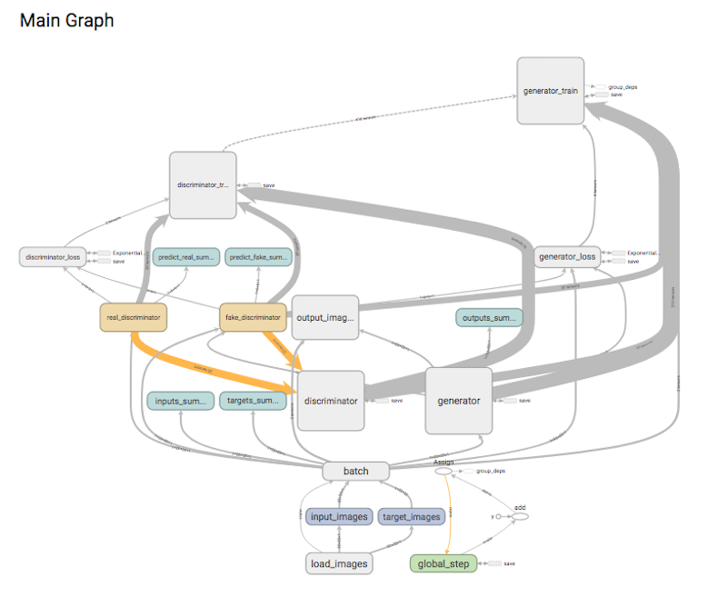

# GCGAN

Train a conditional Generative Adversarial Network (implemented in tensorflow) to subtract point sources from patches of astronomical images, specifically for processing near-infrared images of the Galactic Center.



Resources:

* [Image-to-Image Translation with Conditional Adversarial Nets (P. Isola et al.)](https://phillipi.github.io/pix2pix/)
* [pix2pix-tensorflow (C. Hesse)](https://github.com/affinelayer/pix2pix-tensorflow)
* [PSFGAN: a generative adversarial network system for separating quasar point sources and host galaxy light (D. Stark et al.)](https://arxiv.org/abs/1803.08925)

Example data:

```
python utils/gen_data.py \
  --param_file=utils/psf_parameters.json \
  --output_dir=data \
  --n_train=10000 \
  --n_val=100
```

Training:

```
python pix2pix.py \
  --mode=train \
  --input_dir=data/train \
  --output_dir=train_results \
  --epochs=100 \
  --summary_freq=100 \
  --logging_freq=100 \
  --save_freq=1000
```

Testing:

```
python pix2pix.py \
  --mode=test \
  --checkpoint=train_results \
  --input_dir=data/val \
  --output_dir=val_results
```


